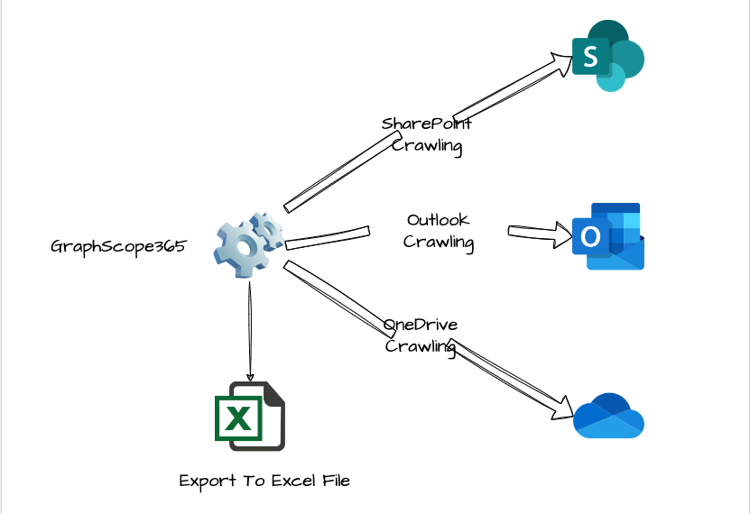
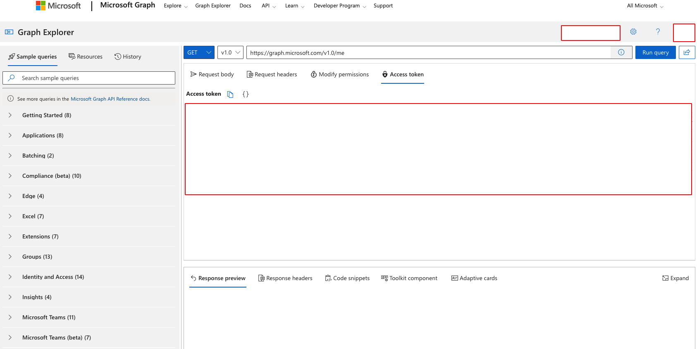

## What is GraphScope365

GraphScope365 is a powerful tool for crawling and reviewing data in Office 365 environment using Microsoft Graph. It enables cyber security experts to scan SharePoint, Outlook and OneDrive for sensitive information and potential security risks.



## How to set up

```
pip3 install -r requirements.txt
```

## How to get access token

Getting an access token for Microsoft Graph can be obatin with Microsoft Graph Explorer. After login is possible to copy the token from the console.



## Options

```
usage: GraphScope365.py [-h] [-m MODULE] [-jwt ACCESSTOKEN] [-f FILTER]

options:
  -h, --help            show this help message and exit
  -m MODULE, --module MODULE
                        outlook,onedrive,sharepoint (default: None)
  -jwt ACCESSTOKEN, --accessToken ACCESSTOKEN
                        Microsoft Graph access token (default: None)
  -f FILTER, --filter FILTER
                        Search Specific Keyword (default: *)
```

Enumerate file accessible by the user in SharePoint

```
.\GraphScope365.py -m sharepoint -jwt {jwt_value} -f {filter}
```

Enumerate file in OneDrive

```
.\GraphScope365.py -m onedrive -jwt {jwt_value}
```

Enumerate emails in Outlook

```
.\GraphScope365.py -m outlook -jwt {jwt_value} -f {filter_value}
```
